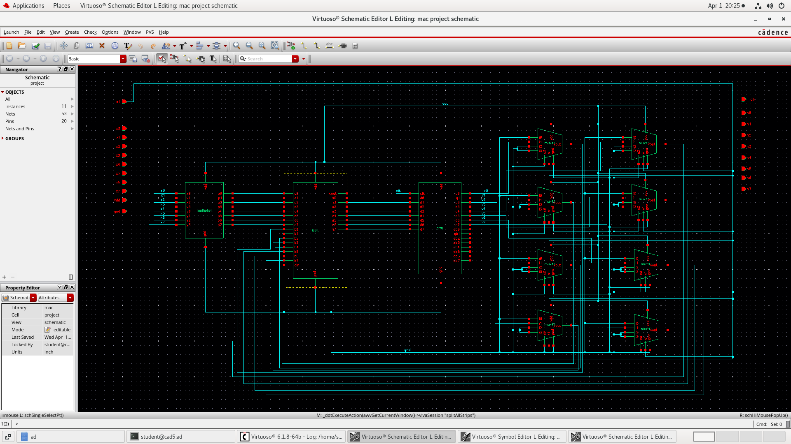
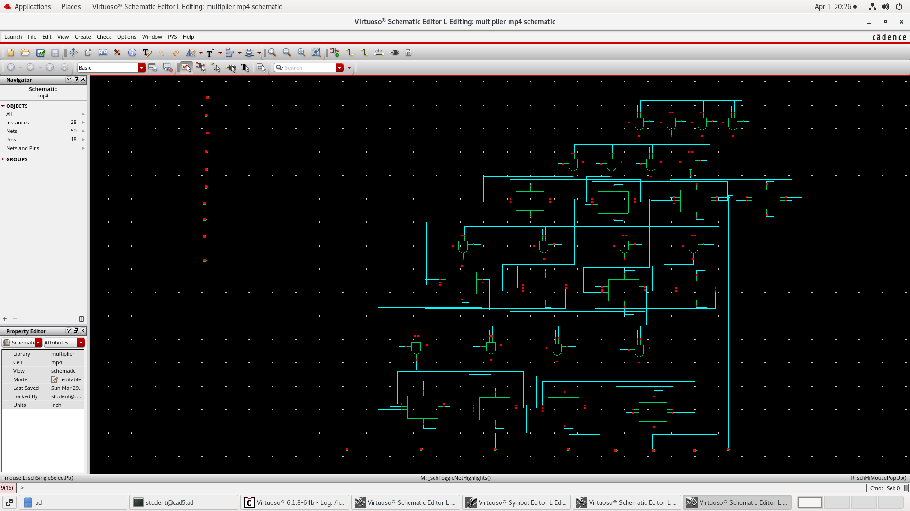
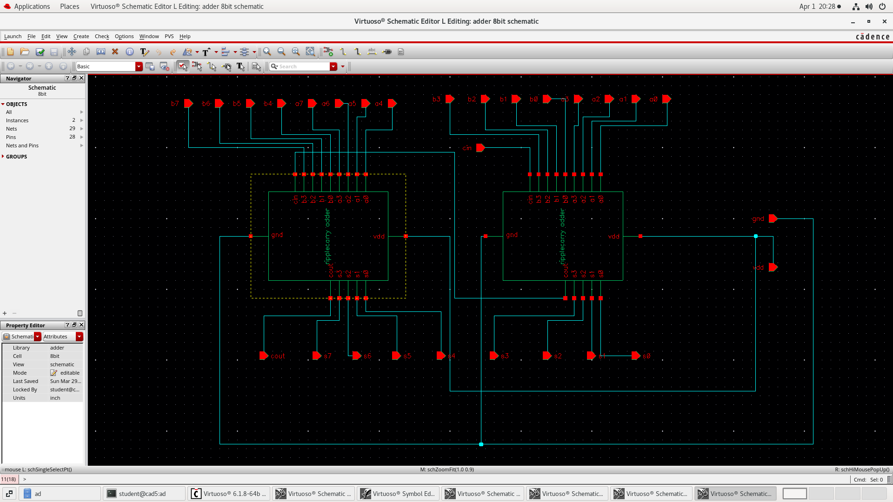
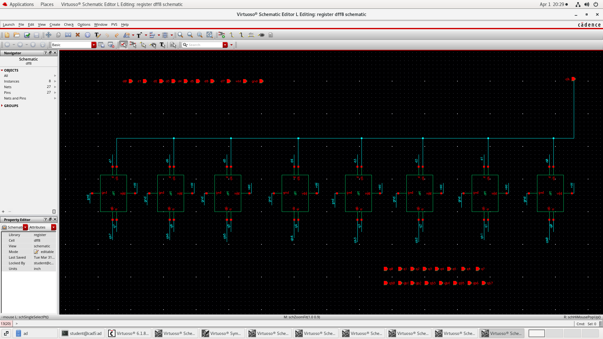
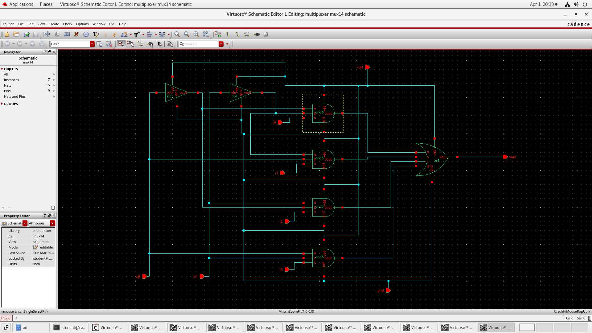
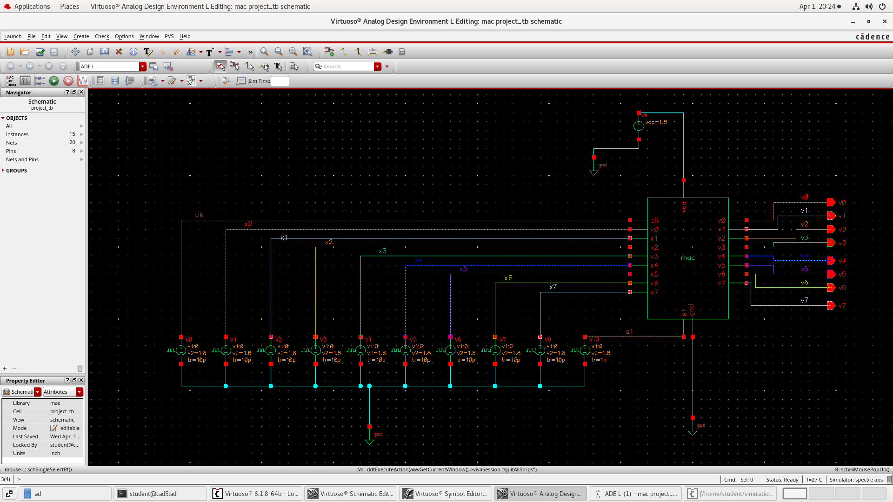
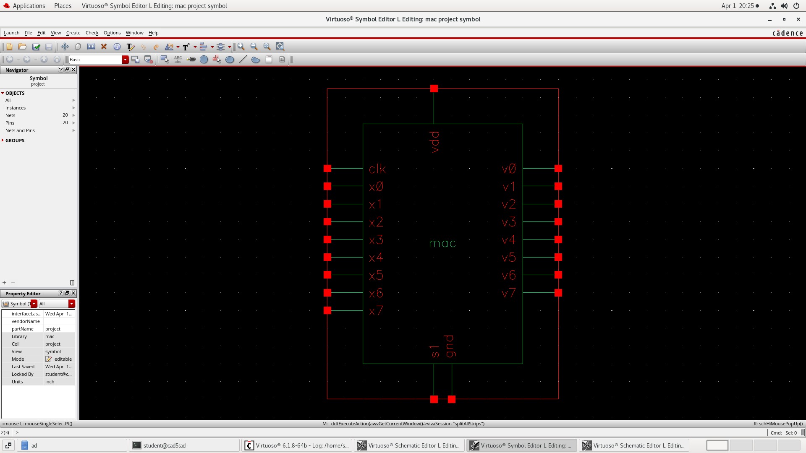

# 🧠 8-bit MAC (Multiply-Accumulate) Design

## 📌 Overview

This project implements an 8-bit MAC (Multiply-Accumulate) unit using analog design in Cadence Virtuoso.

The MAC performs:

* Multiplication of inputs
* Accumulation using registers
* Controlled data flow using multiplexers

---

## 🧩 Components Used

* 8-bit Multiplier
* 8-bit Adder
* 8-bit Register (D Flip-Flops)
* 4:1 Multiplexers (8 units)

---

## 🖼️ MAC Schematic

---

## 🔧 Submodules

### Multiplier

### Adder

### Register

### Multiplexer

---

## 🧪 Testbench

---

## 📊 Results

### Waveform 1

### Waveform 2

---

## 🧷 Symbol

---

## 🛠 Tools Used

* Cadence Virtuoso
* Spectre Simulator

---

## 👩‍💻 Author

Bhavitha N
